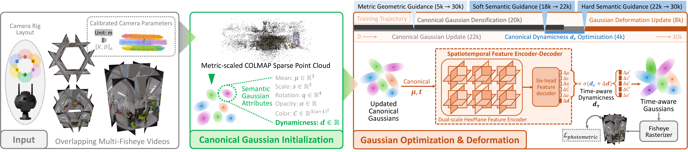

# OmniPrior
This repository is the official PyTorch implementation of [OmniPrior](https://ieeexplore.ieee.org/document/xxx), which was accepted by TVCG. You can watch our [video demo](https://vimeo.com/1198984552?share=copy&fl=sv&fe=ci) here.

## Overview

OmniPrior presents a Gaussian splatting-based approach for dynamic omnidirectional scene representation. Our method directly processes wide field-of-view inputs from multi-fisheye camera rigs, eliminating distortions and information loss from equirectangular projection (ERP) stitching. Through geometric and semantic regularization priors, we effectively leverage the rich spatiotemporal information in raw multi-fisheye videos with omnidirectional coverage. We introduce scheduled activation profiles that modulate prior strength throughout training, allowing regularization to adapt as the scene representation evolves.

<p align="center">
  
</p>

## Installation
The code has been tested on NVIDIA RTX 3090 Ti with PyTorch 2.6.0, CUDA 11.8, and Python 3.10.0.

### Clone the repository
```bash
git clone https://github.com/SiminKoux/OmniPrior.git
```

### Environment setup
```bash
cd OmniPrior

# Step 1: Create and activate conda environment
conda create -n omniprior python=3.10 -y
conda activate omniprior

# Step 1.5 (Optional): Install CUDA 11.8 toolkit
# Skip this step if CUDA 11.8 is already installed system-wide
# Verify with: nvcc --version
conda install -c nvidia/label/cuda-11.8.0 cuda-toolkit=11.8.0 -y

# Step 2: Install PyTorch with CUDA 11.8 support
pip install torch==2.6.0 torchvision==0.21.0 torchaudio==2.6.0 --index-url https://download.pytorch.org/whl/cu118

# Step 3: Install GCC 11 compiler
# Required for building CUDA extensions (CUDA 11.8 supports GCC 7.x-11.x)
conda install -c conda-forge gcc_linux-64=11 gxx_linux-64=11 -y

# Step 4: Install CUDA extension packages
# These packages require PyTorch to be available during compilation
# Note: --no-build-isolation flag allows access to installed PyTorch during build
# Install gsplat (3D Gaussian splatting)
pip install --no-build-isolation git+https://github.com/nerfstudio-project/gsplat.git
# Install fused-ssim (optimized SSIM computation)
pip install --no-build-isolation git+https://github.com/rahul-goel/fused-ssim@328dc9836f513d00c4b5bc38fe30478b4435cbb5
# Install pycolmap (COLMAP Python bindings)
pip install --no-build-isolation git+https://github.com/rmbrualla/pycolmap@cc7ea4b7301720ac29287dbe450952511b32125e
# Install nerfview (NeRF visualization tool)
pip install --no-build-isolation git+https://github.com/nerfstudio-project/nerfview@4538024fe0d15fd1a0e4d760f3695fc44ca72787

# Step 5: Install remaining dependencies
pip install -r requirements.txt
```

## Dataset
You can also download the dataset from [Hugging Face](https://huggingface.co/datasets/SiminKou/OmniFisheyePlus) using:
```bash
git clone https://huggingface.co/datasets/SiminKou/OmniFisheyePlus.git
```
**Example Scene Provided in This Repository**

For your convenience in testing, we have also uploaded an example scene, _**Suite**_, which allows you to directly run ``bash scripts/train_suite.sh`` to obtain synthesized results along with the corresponding models.

**Dataset Composition**
```text
data/
└── OmniFisheye_plus/
    ├── scene1/
    │   ├── images/
    │   │   ├── lens01
    │   │   ├── lens02
    │   │   ├── lens03
    │   │   ├── lens04
    │   │   ├── lens05
    │   │   └── lens06
    │   │       ├── frame_0001.png
    │   │       ├── frame_0002.png
    │   │       └── ...
    │   ├── masks/
    │   │   ├── lens01.npz
    │   │   ├── lens02.npz
    │   │   ├── lens03.npz
    │   │   ├── lens04.npz
    │   │   ├── lens05.npz
    │   │   └── lens06.npz
    │   ├── metric_depths/
    │   │   ├── lens01.npz
    │   │   ├── lens02.npz
    │   │   ├── lens03.npz
    │   │   ├── lens04.npz
    │   │   ├── lens05.npz
    │   │   └── lens06.npz
    │   ├── mono_depths/
    │   │   ├── lens01.pt
    │   │   ├── lens02.pt
    │   │   ├── lens03.pt
    │   │   ├── lens04.pt
    │   │   ├── lens05.pt
    │   │   └── lens06.pt
    │   ├── robot_range/
    │   │   ├── lens01.npy
    │   │   ├── lens02.npy
    │   │   ├── lens03.npy
    │   │   ├── lens04.npy
    │   │   ├── lens05.npy
    │   │   └── lens06.npy
    │   ├── sparse/
    │   │   ├── 0/
    │   │   │   ├── cameras.bin
    │   │   │   ├── cameras.txt
    │   │   │   ├── images.bin
    │   │   │   ├── images.txt
    │   │   │   ├── points3D.bin
    │   │   │   ├── points3D.txt
    │   │   │   └── project.ini
    │   │   └── rescaled/
    │   │       ├── cameras.bin
    │   │       ├── cameras.txt
    │   │       ├── images.bin
    │   │       ├── images.txt
    │   │       ├── points3D.bin
    │   │       └── points3D.txt
    │   ├── transformed_masks/
    │   │   ├── crop01.npz
    │   │   ├── crop02.npz
    │   │   ├── crop03.npz
    │   │   ├── crop04.npz
    │   │   ├── crop05.npz
    │   │   └── crop06.npz
    │   ├── metadata.json
    │   └── sparse_matches.pkl
    ├── scene2/
    │   ├── images/
    │   ├── masks/
    │   ├── metric_depths/
    │   ├── mono_depths/
    │   ├── robot_range/
    │   ├── sparse/
    │   ├── transformed_masks/
    │   ├── metadata.json
    │   └── sparse_matches.pkl
    └── ...
```

**Note:**
- **Frame synchronization**: Each lens subfolder in `images/` contains the same number of frames with matching filenames across all lenses.
- **Robot platform data**: The `robot_range/` folder is only available for robot-captured scenes. For handheld scenes (`Concert`, `Hall`, `Lounge`, `Studio`), this folder does not exist.
- **Multi-perspective evaluation**: The `transformed_masks/` folder contains masks for evaluation in the multi-perspective domain (90° FoV).

## Training
Run the full model optimization for all scenes:
```bash
bash scripts/train_all.sh
```

This executes the complete training pipeline with all components enabled.

## Results Composition
```text
results/
├── scene1/
│   └── init_colmap_metric/
│       ├── ckpts/
│       │   ├── ckpt_17999_rank0.pt
│       │   ├── ckpt_21999_rank0.pt
│       │   ├── ckpt_29999_rank0.pt
│       │   └── ckpt_final_rank0.pt
│       ├── ply/
│       │   ├── point_cloud_17999.ply
│       │   ├── point_cloud_21999.ply
│       │   ├── point_cloud_29999.ply
│       │   └── point_cloud_final.ply
│       ├── renders/
│       │   ├── test/
│       │   │   ├── gt_final/
│       │   │   │   ├── lens01/
│       │   │   │   │   ├── frame_0008.png
│       │   │   │   │   ├── frame_0009.png
│       │   │   │   │   └── ...
│       │   │   │   ├── lens02/
│       │   │   │   ├── ...
│       │   │   │   └── lens06/
│       │   │   │       ├── frame_0008.png
│       │   │   │       ├── frame_0009.png
│       │   │   │       └── ...
│       │   │   └── renders_final/
│       │   │       ├── lens01/
│       │   │       │   ├── frame_0008.png
│       │   │       │   ├── frame_0009.png
│       │   │       │   └── ...
│       │   │       ├── lens02/
│       │   │       ├── ...
│       │   │       └── lens06/
│       │   │           ├── frame_0008.png
│       │   │           ├── frame_0009.png
│       │   │           └── ...
│       │   └── train/
│       │       ├── gt_final/
│       │       │   ├── lens01/
│       │       │   │   ├── frame_0001.png
│       │       │   │   ├── frame_0002.png
│       │       │   │   └── ...
│       │       │   ├── lens02/
│       │       │   ├── ...
│       │       │   └── lens06/
│       │       │       ├── frame_0001.png
│       │       │       ├── frame_0002.png
│       │       │       └── ...
│       │       └── renders_final/
│       ├── stats/
│       │   ├── train_6999_rank0.json
│       │   ├── ...
│       │   ├── training_time_fps.txt
│       │   ├── ...
│       │   └── val_29999.json
│       ├── tb/
│       └── cfg.yml
├── scene2/
│   └── sfm_rescaled_init/
│       ├── ckpt/
│       ├── ply/
│       ├── renders/
│       ├── stats/
│       ├── tb/
│       └── cfg.yml
└── ...
```

## Evaluation and Rendering

### Visual Quality Evaluation

#### Multi-Fisheye Domain

Evaluate visual quality in the raw multi-fisheye domain across dynamic-focused regions and full images:
```bash
python scripts/eval_multi-fisheye.py --scene <scene_name>
```

**Example**: Evaluate the `Suite` scene:
```bash
python scripts/eval_multi-fisheye.py --scene suite
```

Results are saved to `stats/multi-fisheye/omniprior/`. View `overall_stats.csv` for a summary table of all metrics.

#### Multi-Perspective Domain

**Step 1: Convert fisheye images to perspective format**

Before evaluation, convert fisheye images to perspective projections:
```bash
python scripts/fish2pers.py --scene <scene_name>
# Or convert all scenes at once:
python scripts/fish2pers.py --all
```

**Step 2: Evaluate visual quality**

Evaluate rendering quality in the multi-perspective domain (90° FoV) across dynamic-focused regions and full images:
```bash
python scripts/eval_multi-perspective.py --scene <scene_name>
```

**Example**: Evaluate the `Suite` scene:
```bash
python scripts/eval_multi-perspective.py --scene suite
```

Results are saved to `stats/multi-perspective/omniprior/`. View `overall_stats.csv` for a summary table of all metrics.

### Depth Evaluation

Evaluate reconstruction quality using metric depth:
```bash
bash scripts/eval_depth.sh
```

Renders metric depth maps for each frame using the Gaussian rasterizer (saved to `renders/`) and computes quantitative metrics (saved to `stats/`).

### Rendering

#### 6DoF Viewing

Generate a video showcasing 6DoF viewing with a synthesized camera trajectory:
```bash
bash scripts/render_6dof.sh
```
The rendered frames, interactive camera trajectory visualization, and the rendered video are saved in the folder `6dof_views/`.

#### Motion-Freeze Rendering

Render videos with selective motion control:
```bash
bash scripts/render_freeze.sh
```

Two rendering modes are available:
- **Static Freeze Mode (SFM)**: Fixed viewpoint with animated dynamic components
- **Dynamic Freeze Mode (DFM)**: Frozen dynamic components with moving camera

Set the mode using `--freeze_mode {static|dynamic}` in the script.

Rendered frames and videos are saved to `motion_freeze/static/` or `motion_freeze/dynamic/`.

**Note**: Adjust `--dyn_app_threshold` based on your scene (paper setting: 0.7 for the scene `Loft`).

### Dynamicness Visualization

Visualize learned dynamicness information:
```bash
bash scripts/dyn_vis.sh
```

This generates:
- Dynamicness distribution statistics
- Dynamicness probability heatmaps
- High-dynamic-probability region visualizations

The visualization results are saved in the `dyn_vis/` folder.

**Note**: Adjust `--dyn_app_threshold` based on your scene (paper settings: 0.6 for `Suite`, 0.66 for `Concert`).

## Citation
Cite as below if you find this paper, dataset, and repository helpful to you:
```
@article{kou2026omniprior,
  title={OmniPrior: A Multi-Prior-Guided Omnidirectional Representation of Dynamic Scenes in Overlapping Ultra-Wide Multi-Fisheye Videos},
  author={Kou, Simin and Zhang, Fang-Lue and Nazarenus, Jakob and Koch, Reinhard and Can, Wang and Dodgson, Neil A},
  journal={IEEE Transactions on Visualization and Computer Graphics},
  year={2026},
  volume={31},
  number={5},
  pages={4095-4109},
  publisher={IEEE}
}
```

## Acknowledgement
Our code is hugely influenced by [gsplat](https://github.com/nerfstudio-project/gsplat?tab=readme-ov-file), [4D-GS](https://github.com/hustvl/4DGaussians), [3DGUT](https://github.com/nv-tlabs/3dgrut), and many other projects. We would like to acknowledge them for making great code available to us.

## Copyright and license

Code and documentation copyright the authors. Code released under the [MIT License](https://reponame/blob/master/LICENSE).
